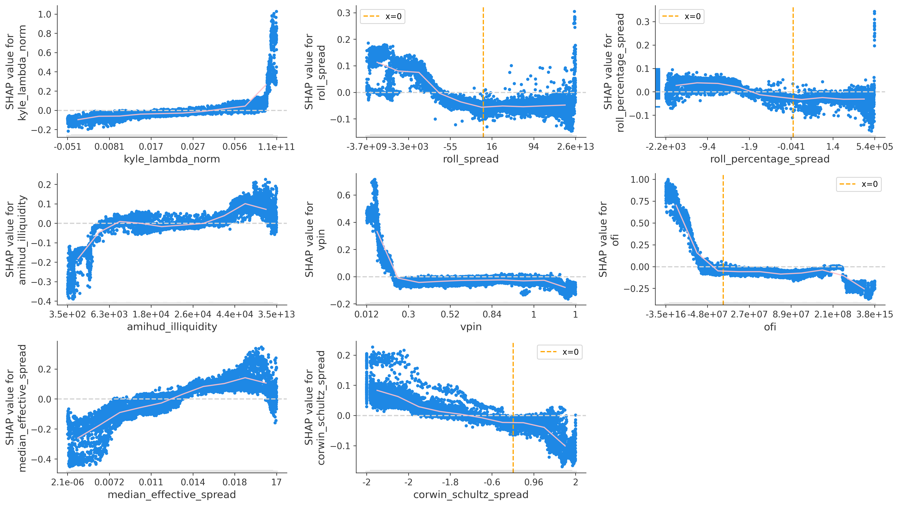

# Can Market Microstructure Measures Enhance Early Rug Pull Detection?

### *Bachelor Thesis*

****

## Abstract

While rug pulls are among the biggest threats in cryptocurrency markets, only a few of studies have attempted to build early detection models for malicious tokens. I conducted a comprehensive rug pull prediction study on Solana’s Raydium DEX, testing whether market microstructure measures can enhance identification of malicious coins.

With 32,594 token launches analyzed, I conducted an A/B test on model performance before and after adding features like Kyle’s lambda and VPIN. The analysis suggests that these features can lead to an incremental, yet statistically significant improvement in performance, mostly consistent with microstructure theory. These results are partially robust to choice of model, hyperparameter selection and labeling approach.

## Repository Structure

    BT
    ├── data                    # data collected from outside sources + the final dataset
    ├── data_collection         # SQL and Python used for data collection
    ├── data_engineering        # raw data processing and feature/target calculations
    ├── model_storage           # saves of trained models, split by configuration type
    ├── utils                   # utility funcions, used in the main pipeline
    ├── visuals                 # saved chart images
    ├── LICENSE
    ├── README.md
    └── main.ipynb              # Jupyter notebook with the core study pipeline

